# redis
This is the redis course from udemy
https://www.udemy.com/course/redis-the-complete-developers-guide-p<br>

https://www.drawio.com/<br>

https://rbook.cloud/<br>
https://www.udemy.com/course/redis-the-complete-developers-guide-p/learn/lecture/32883916#overview
# 0. Tips
1. bypass udemy black screen
```bash
# 1. [NOT GOOD]
chrome exteions: nimbus

# 2. 
disable chrome hardware acceleration
```


# 0. Intro
1. why redis?
    - retrieve data from memory is fast from hard drive is slow
        1. All data stored in memory
        2. data is organized in simple data structures
        3. Redis has a simple feature set


2. Redis Setup
- setup in docker container
```bash
# pull redis image
$ docker pull redis

# start redis container
# https://blog.csdn.net/y117862654/article/details/129096050
$ docker run -d --name redis_container -p 6379:6379 redis redis-server --appendonly yes --requirepass "redis"


# connect to redis with redis-clit
$ docker exec -it redis_container redis-cli

# authentication vis redis-cli
>>AUTH "redis"

# checking local port
$ lsof -i -P -n | grep LISTEN

# run redis stack
# https://redis.io/docs/getting-started/install-stack/docker/
$ docker run -d -v /Users/runzhou/git/redis/data/:/data --name redis_stack_container -p 6380:6379 -p 8001:8001 redis/redis-stack:latest


$ docker exec -it redis_stack_container redis-cli
```

- setup in macos
    - https://redis.io/docs/getting-started/installation/install-redis-on-mac-os/
    - https://www.udemy.com/course/redis-the-complete-developers-guide-p/learn/lecture/32883916#overview


<br><br><br><br><br><br>

# 2. Redis commands

<br><br><br>

## 2.1 basic command
1. cmds
```bash
# authentication
$ AUTH "redis"

# list all keys
$ KEYS *

# set key value
$ SET message 'Hi there!'


# retrieve value via key
$ GET message
```

2. principles


3. Types of commands


<br><br><br>

## 2.2 docs of commands
1. commands
https://redis.io/commands/<br>

<br><br><br>

## 2.3  Working with string

1. NX | XX
    - key, key we are trying to set
    - value, value we want to store
    - EX | PX | EXAT | PXAT | KEEPTTL, options for when this value should expire
    - NX | XX, only set this key if..., NX - not exist, XX - exist
    - GET, return the previous value stored at this key
```bash
# XX
127.0.0.1:6379> SET color green XX
OK
127.0.0.1:6379> SET ghgkhjk green XX
(nil)

# NX
127.0.0.1:6379> SET ghgkhjk green NX
OK
127.0.0.1:6379> SET color green NX
(nil)
```

2. EX | PX | EXAT | PXAT | KEEPTTL
    - https://redis.io/commands/set/
    - redis automatically delete your data after a certain amount of time
    - why we need this auto-deletion mechanism?
        1. redis built for caching
        2. hit cache checking redis first
        3. disable cache in some time period later
        4. when searching, return from traditional database and save copy to the redis

```bash
# 
127.0.0.1:6379> SET color red EX 2
OK
# immediately
127.0.0.1:6379> GET color
"red"
# wait after 2 seconds
127.0.0.1:6379> GET color
(nil)

```

3. SET multiple keys
```bash
# SETEX = SET + EX
$ SETEX color 2 black

# SETNX = SET + NX
$ SETNX color black

# MSET
$ MSET color black car toyota


# MSETNX, if any of the keys already exist, no set is done
$ MSETNX color black car toyota
```


4. GET and MGET
```bash
127.0.0.1:6379> MGET color car
1) "black"
2) "toyota"
```

5. String range
```bash
# GETRANGE
127.0.0.1:6379> GETRANGE car 0 2
"toy"

# SETRANGE, update portion of a string
127.0.0.1:6379> GET car
"toyota"
127.0.0.1:6379> SETRANGE car 2 blue
(integer) 6
127.0.0.1:6379> GET car
"toblue"
```

6. are above cmds useful?
    - scenarios in traditional database
        1. fetch one to three properties of a single item
        2. update one to three properties of a single item
        3. fetch all propeties related to several items
        4. create several items
    - tricks in redis
        1. limited values for each features, encode into a: red, b: green


- in this way, redis make accessing and updating data as fast as possible


<br><br><br>

## 2.4 Working with numbers

1. integer operations cmds

```bash
127.0.0.1:6379> SET age 20
OK
127.0.0.1:6379> INCR age
(integer) 21
127.0.0.1:6379> DECR age
(integer) 20
127.0.0.1:6379> INCRBY age 20
(integer) 40
127.0.0.1:6379> DECRBY age 15
(integer) 25


# increase by float
127.0.0.1:6379> INCRBYFLOAT age 6.22
"31.22"

# if it's after u incr by float
(error) ERR value is not an integer or out of range

# decrease by float
127.0.0.1:6379> INCRBYFLOAT age -1.05
"26.95"
```

2. why those DECR etc cmds exist?
    - two requests at the same time
        - facing concurrency issue
        - 
    - Possible solutions
        1. use a Redis txn with "WATCH"
        2. Use a lock
        3. Use INCR
    - Redis only has one thread and process 1 cmd at a time. 
        - first one 21
        - second one 22
        - 
        


## 2.5 Exercise
```bash
# not exist set
$ SETNX shape triangle
$ SET shape square NX


# expire after 5 seconds
$ SETEX news 5 "Today's Headlines"
$ SET news "Today's Headlines" EX 5
$ SET news "Today's Headlines" PX 5000
$ GET news
```

<br><br><br><br><br><br>

# 3. E-Commerce App Setup

<br><br><br>

## 3.1 Setup
1. Node JS setup
2. extract rbay.zip
3. npm install
4. add connection info to the .env file
5. start the project by running `npm run dev`

<br><br><br>

## 3.2 Redis Client Lib
- redis js command, https://redis.js.org/#node-redis-usage-redis-commands
- jedis, java version of redis lib, https://www.javadoc.io/doc/redis.clients/jedis/latest/index.html
```ts
// GET color
client.get('color')

// SET color red
client.get('color', 'red')

// GET color red EX 2 GET
client.set('color', 'red', {
    EX: 2,
    GET: true
})


```

<br><br><br>

## 3.3 First Implementation task
- 

<br><br><br>

## 3.4 Redis Design methodology
1. SQL 
    - put the data in tables
    - figure out how we will query it

2. Redis
    - figure out what queries we need to answer
    - structure data to best answer those queries

3. Design considerations
    - what type of data are we storing?
        - Strings
    - should we be concered about the size of data?
        - `YES! Only cache certain pages`
    - do we need to expire this data?
        - Yes, expire after some number of minutes/hours/days
    - what will the key naming policy be for this data?
    - any business-logic concerns?
        - NO

4. Pages
    - Custom Pages, .334MB for each user
        - will change often
    - Static page, .22MB for all users
        - will not ofen change
    - one page normally 57.1kb
    - 

5. Key Naming methodology
    - key should be unique
    - other engineers should understand what a key is for
    - tip - use functions to generate your key names so you never make a typo
    - extremely common practice is to use a `:` to separate differnt parts of the key
        - users:45
        - items:19
        - users:posts:901
        - posts:jqip25jnm
    - `small twist on common practice` we're going to use a # before unique ID's to make implementing search easier
        - users#45
        - items#19
        - users#posts#901
        - posts#jqip25jnm
    - 
    
```bash
# Page Name             Address                                 Unique Route
Privacy Page            localhost:3000/privacy                  /privacy
About Us Page           localhost:3000/about                    /about
Sign In Page            localhost:3000/auth/signin              /auth/signin
Sign Up Page            localhost:3000/auth/signup              /auth/signup

# Redis
# basekey page -> pagecache
pagecache#/about                    <html></html>
pagecache#/privacy                  <html></html>
pagecache#/auth/signin              <html></html>
pagecache#/auth/signup              <html></html>
```

<br><br><br>

## 3.5 Adding Page Caching
- after this the page access will be much faster
    - 
    


## 3.6 Better Key Generation
- to avoid below typo
```ts
client.get('pagecach#' + someValue);
```

<br><br><br><br><br><br>

# 4. Hash Data Structure

<br><br><br>

## 4.1 Hashes in redis
1. not allowed deeply nested data structure
    - 

2. storing and retrieving hashes
    - Hash cmds
    - 
    
```bash
# HSET  
127.0.0.1:6379> HSET company name 'Concrete Co' age 1915 industry materials revenue 5.3
(integer) 4

# HGET
127.0.0.1:6379> HGET company name
"Concrete Co"

# HGETALL
127.0.0.1:6379> HGETALL company
1) "name"
2) "Concrete Co"
3) "age"
4) "1915"
5) "industry"
6) "materials"
7) "revenue"
8) "5.3"

```

3. Deleting Hash Data
```bash
# HEXISTS
127.0.0.1:6379> HEXISTS company age
(integer) 1

# DEL, delete entire key
127.0.0.1:6379> DEL company
(integer) 1
127.0.0.1:6379> HGETALL company
(empty array)

# HDEL, delete a single key-value
127.0.0.1:6379> HSET company name 'Concrete Co' age 1915 industry materials revenue 5.3
(integer) 4
127.0.0.1:6379> HDEL company age
(integer) 1
127.0.0.1:6379> HGETALL company
1) "name"
2) "Concrete Co"
3) "industry"
4) "materials"
5) "revenue"
6) "5.3"
```

4. Numbers in Hashes
```bash
# HINCRBY
127.0.0.1:6379> HINCRBY company age 10
(integer) 1925
127.0.0.1:6379> HGETALL company
1) "name"
2) "Concrete Co"
3) "industry"
4) "materials"
5) "revenue"
6) "5.3"
7) "age"
8) "1925"
127.0.0.1:6379> 


# HINCRBYFLOAT
127.0.0.1:6379> HINCRBYFLOAT company revenue 1.025
"6.325"
127.0.0.1:6379> HGETALL company
1) "name"
2) "Concrete Co"
3) "industry"
4) "materials"
5) "revenue"
6) "6.325"
7) "age"
8) "1925"

# HSTRLEN
127.0.0.1:6379> HSTRLEN company name
(integer) 11


# HKEYS
127.0.0.1:6379> HKEYS company
1) "name"
2) "industry"
3) "revenue"
4) "age"

# HVALS
127.0.0.1:6379> HVALS company
1) "Concrete Co"
2) "materials"
3) "6.325"
4) "1925"
```
    - 


<br><br><br><br><br><br>

# 5. Redis has gotcha's

## 5.1 Issues with HSET

1. prepare the HGETALL command
2. put in the value for each key, calling the 'toString()' method on each value
3. `TypeError: Cannot read properties of null (reading 'toString')`
    - 
    - 
    

```js
import 'dotenv/config';
import { client } from '../src/services/redis';

const run = async () => {
	await client.hSet('car', {
		color: 'red',
		year: 1950,
		engine: { cylinders: 8 },
		owner: null || '', // put a empty string
		service: undefined || ''
	});
	// HSET car color read year 1950

	const car = await client.hGetAll('car');

	console.log(car);
};
run();
```
- 


## 5.2 Issues with HGETALL
1. when you get a null key, it return an object, you need check the length instead of checking it's null

```js 
// (1) not enter the condition block
const car = await client.hGetAll('car#1993');
if (!car) {
    console.log('Car not found, respond with 404');
    return;
}
[INFO] 21:40:59 Restarting: /Users/runzhou/git/redis/sec3-ecommerce_app/rbay/sandbox/index.ts has been modified
[Object: null prototype] {}


// (2) able to check its null
const car = await client.hGetAll('car#1993');
if (Object.keys(car).length === 0) {
    console.log('Car not found, respond with 404');
    return;
}
[INFO] 21:41:38 Restarting: /Users/runzhou/git/redis/sec3-ecommerce_app/rbay/sandbox/index.ts has been modified
Car not found, respond with 404
```

<br><br><br><br><br><br>

# 6. powerful design patterns

## 6.1 App overview

1. walkthrough
    - walkthrough of the app
    - how to store data in Redis
    - what data should be stored as hashes

2. basic auction rules
    - users create 'items' to sell
    - items have a starting price and an ending time
    - other users can 'bid' on an item, a bit must be higher than all previous bids
    - at the ending time, the user with higher bid wins the item    

<br><br><br>

## 6.2 reducing design to queries
1. figure out what queries we need to answer
2. structure data to best answer those queries


Landing Page
- items sorted by price
- items sorted by ending time
- items sorted by views
- search for items by name
- 

Sign in
- find a user with given user name
- create a session (auth)
- find a session (auth)
- get a user with a given ID (auth)
- 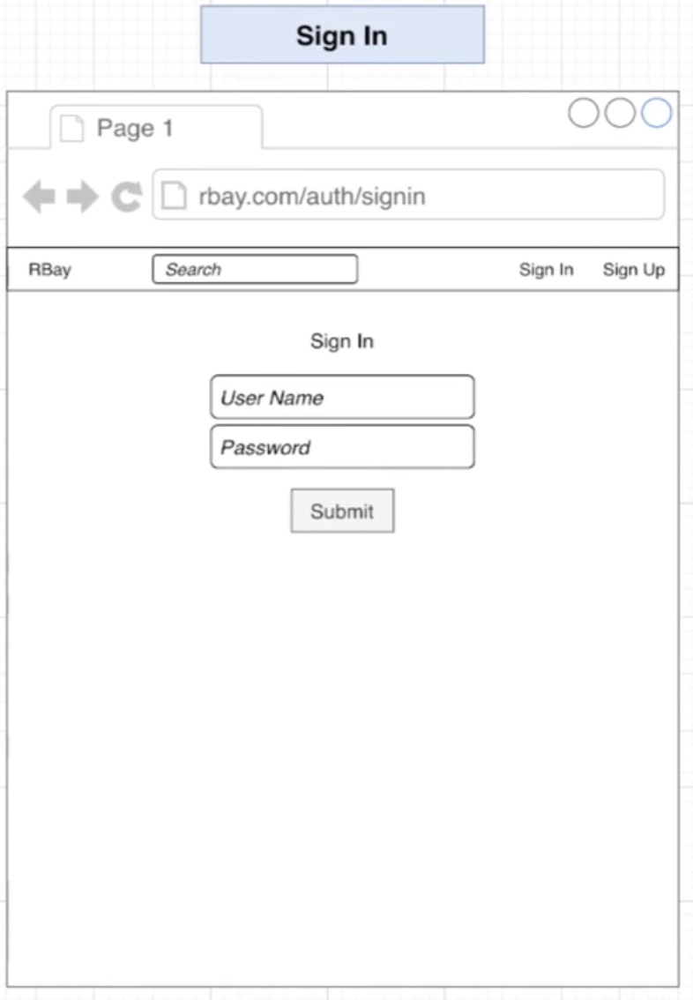

Sign up
- create a user
- 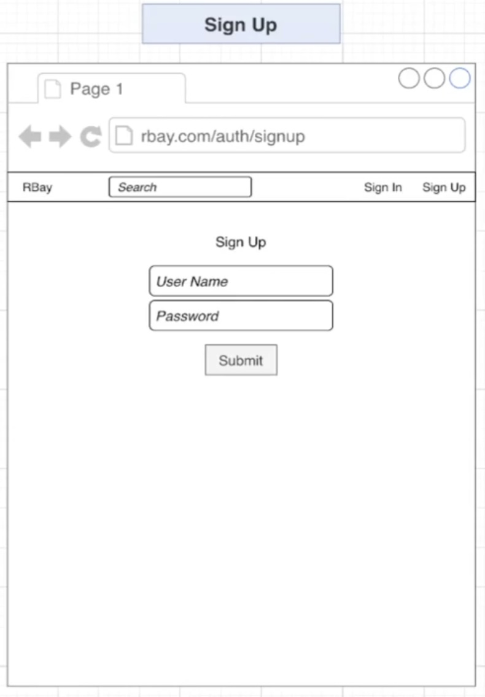

Item Create
- Create an item
- 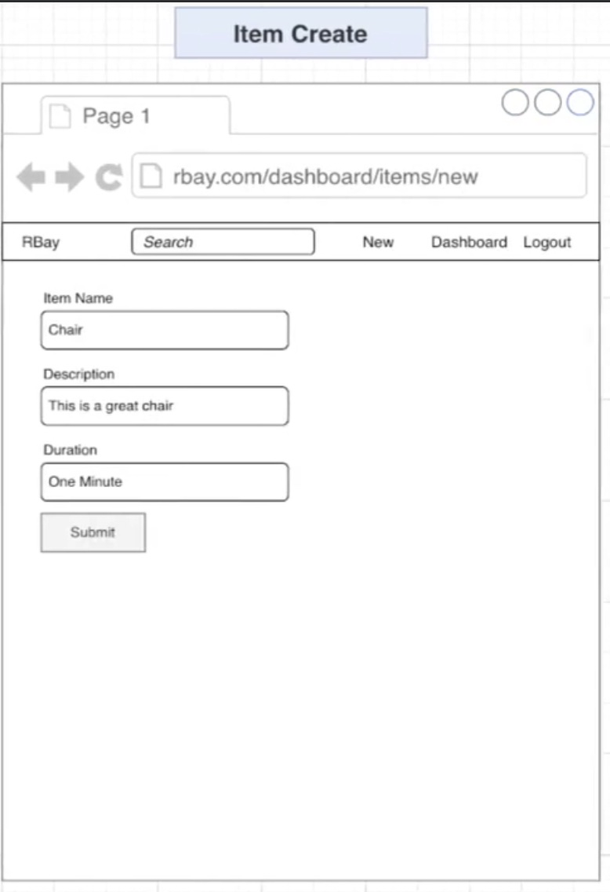

Item Show
- fetch an item with a given ID
- find the # of likes tied to an item
- like an item
- unlike an item
- see if current user lieks an item
- create a bid tied to an item
- find the bid history of an item
- find items similar to an existing item
- increment the number of views for an item
- 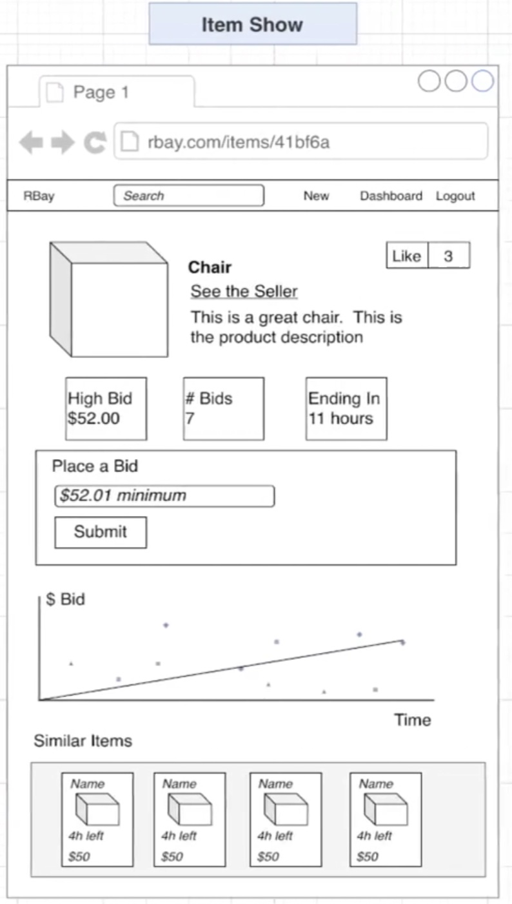

Seller profile
- find items a user likes
- find items two different users both like
- 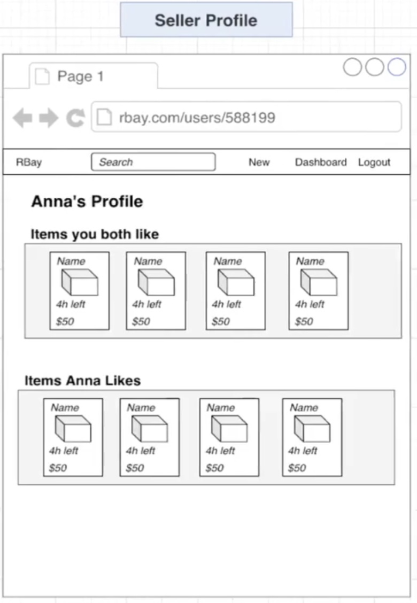

dashboard
- find items created by a user, sorted by various criteria
- 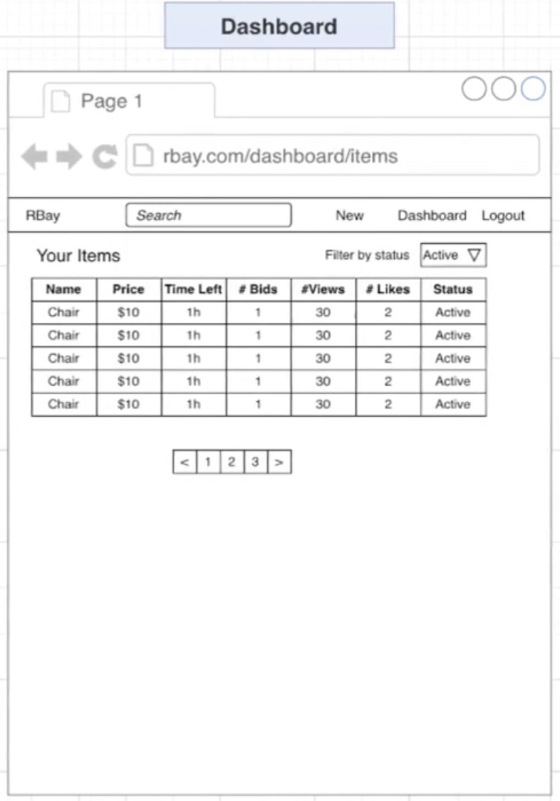


'things' in our app
- users
- sessions
- items
- bids
- views
- likes


<br><br><br>

## 6.3 date type for each resources

1. Store as hash
    - the record has many attributes
    - a collection of these records have to be sorted many different ways
    - often need to access a single record at a time
    - `users, sessions, items`


2. Not store as hash
    - the record is only for counting or enforcing uniqueness
    - record stores only one or two attributes
    - used only for creating relations between different records
    - the record is only used for time series data
    - `likes, views, bids`


<br><br><br>

## 6.4 create user implementation


1. why create separate object instead of passing attrs directly?
```ts
export const createUser = async (attrs: CreateUserAttrs) => {
	const id = genId();
	await client.hSet(usersKey(id), {
		username: attrs.username,
		password: attrs.password
	});

	return id;
};

// ===to===> 

export const createUser = async (attrs: CreateUserAttrs) => {
	const id = genId();
	await client.hSet(usersKey(id), serialize(attrs));

	return id;
};

const serialize = (user: CreateUserAttrs) => {
	return {
		username: user.username,
		passowrd: user.password
	};
};

```


2. Save data
    - dont need to store the ID
    - date might be in a format that we don't want 


3. retrieve data
    - we probably want the ID included in this objec
    - we probably want 'revenue' as a number, not a string
    - we probably want 'createdAt' as a Date object, not a string

4. serialize
    - take some information and encode it to be sent off and stored or used by some other kind of system
    1.  gets an object ready to go INTO Redis as a hash
    2. removed id
    3. turns dates into a querable format


5. deserialize
    -  receive some information that might be encoded in a strange way and prepare this information to be used in a format that is readily consumed by our application
    1. turns strings into numbers
    2. adds the ID
    3. turns createdAt into a Date object


<br><br><br>

## 6.5 implmenting sessions

Sign up
1. create a new hash with the provided username + password
2. we need to consider this person to be signed in to our app
3. generate a 'session token', and create a new hash with details about this person in redis
4. randomly generated session token is '551'
5. send session token back to browser
- 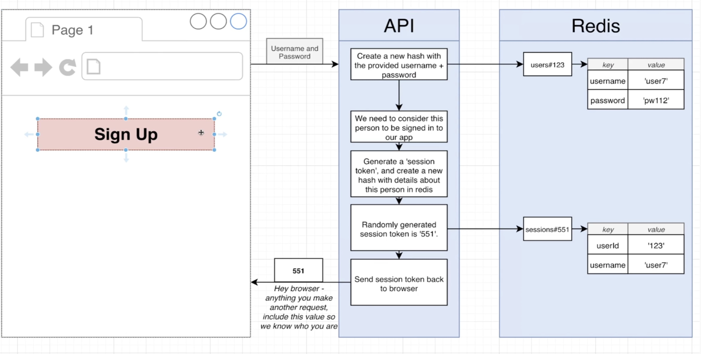


Create n new item
1. someone is trying to create an item, let's make sure they are logged in
2. get the session token from the incoming request 551
3. see if there's a stored session with that ID
4. there is! the person making the request must be 'user7'
- 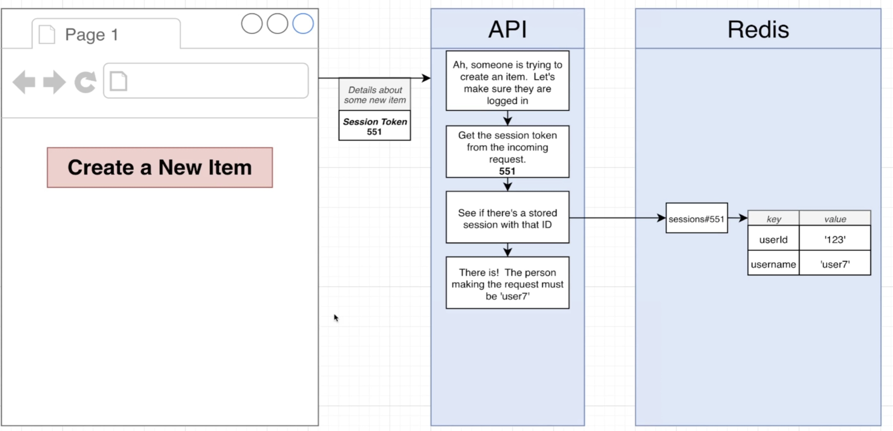


<br><br><br>

## 6.6 fetching a saved session

1. redis find nothing and return u an empty object

- 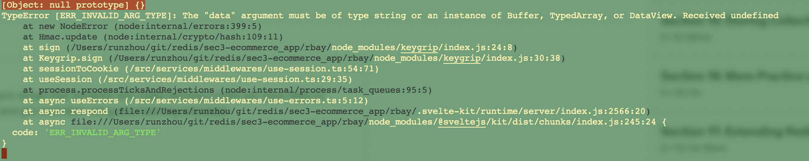


<br><br><br>

## 6.6 creating sessions
```ts

export const saveSession = async (session: Session) => {
	return client.hSet(
		sessionKey(session.id), 
		serialize(session)
	);
};
const serialize = (session: Session) => {
	return {
		userId: session.userId,
		username: session.username
	};
};

```

<br><br><br>

## 6.7 serializing date times

- 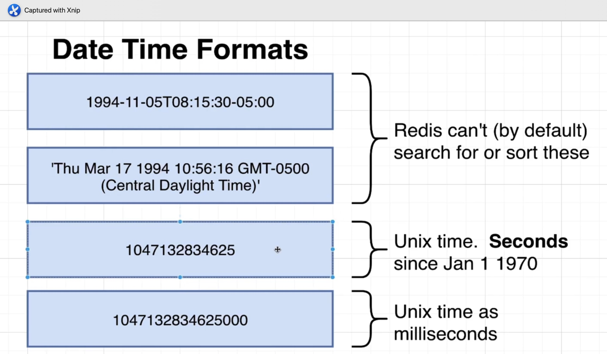


## 6.8 store and fetch items

1. item created and able to retrieve from redis
- 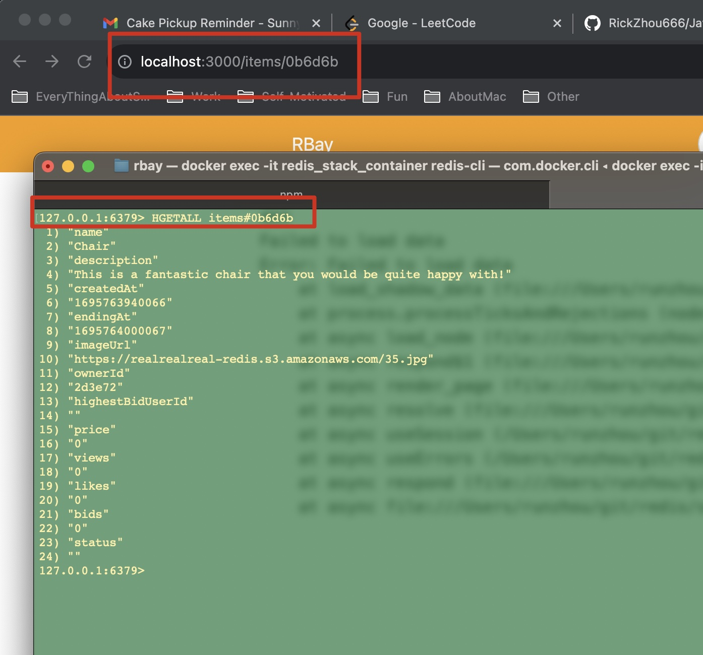
